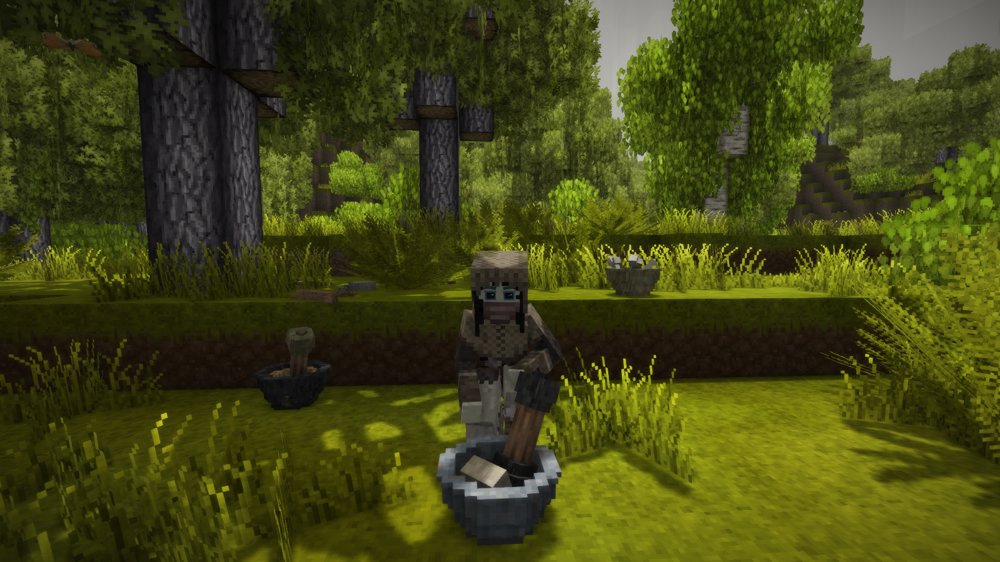

## Ancient Tools

 A collection of useful tools from ancient times.

 

### Description

 Hello and welcome to the GitHub repository for Ancient Tools. This project is a mod for the survival adventure game Vintage Story which adds an assortment of immersive, interactive tools to the game.

### Releases

#### Vintage Story 1.17.0+ 
[Version 1.5.0](https://github.com/TaskaRaine/Ancient-Tools/releases/download/1.5.0/AncientTools_V1.5.0.zip)

[Version 1.4.9](https://github.com/TaskaRaine/Ancient-Tools/releases/download/1.4.9/AncientTools_V1.4.9.zip)

[Version 1.4.8](https://github.com/TaskaRaine/Ancient-Tools/releases/download/1.4.8/AncientTools_V1.4.8.zip)

[Version 1.4.7](https://github.com/TaskaRaine/Ancient-Tools/releases/download/1.4.7/AncientTools_V1.4.7.zip)

[Version 1.4.6](https://github.com/TaskaRaine/Ancient-Tools/releases/download/1.4.6/AncientTools_V1.4.6.zip)

[Version 1.4.5](https://github.com/TaskaRaine/Ancient-Tools/releases/download/1.4.5/AncientTools_V1.4.5.zip)

#### Vintage Story 1.16.0+
[Version 1.4.4](https://github.com/TaskaRaine/Ancient-Tools/releases/download/1.4.4/AncientTools_V1.4.4.zip)

[Version 1.4.3](https://github.com/TaskaRaine/Ancient-Tools/releases/download/1.4.3/AncientTools_V1.4.3.zip)

[Version 1.4.2](https://github.com/TaskaRaine/Ancient-Tools/releases/download/1.4.2/AncientTools_V1.4.2.zip)

[Version 1.4.1](https://github.com/TaskaRaine/Ancient-Tools/releases/download/1.4.1/AncientTools_V1.4.1.zip)

[Version 1.4.0](https://github.com/TaskaRaine/Ancient-Tools/releases/download/1.4.0/AncientTools_V1.4.0.zip)

[Version 1.3.6](https://github.com/TaskaRaine/Ancient-Tools/releases/download/1.3.6/AncientTools_V1.3.6.zip)

[Version 1.3.5](https://github.com/TaskaRaine/Ancient-Tools/releases/download/1.3.5/AncientTools_V1.3.5.zip)

[Version 1.3.4](https://github.com/TaskaRaine/Ancient-Tools/releases/download/1.3.4/AncientTools_V1.3.4.zip)

[Version 1.3.2](https://github.com/TaskaRaine/Ancient-Tools/releases/download/1.3.2/AncientTools_V1.3.2.zip)

[Version 1.3.1](https://github.com/TaskaRaine/Ancient-Tools/releases/download/1.3.1/AncientTools_V1.3.1.zip)

[Version 1.3.0](https://github.com/TaskaRaine/Ancient-Tools/releases/download/1.3.0/AncientTools_V1.3.0.zip)

#### Vintage Story 1.15.0+
[Version 1.2.4](https://github.com/TaskaRaine/Ancient-Tools/releases/download/1.2.4/AncientTools_V1.2.4.zip)

[Version 1.2.3](https://github.com/TaskaRaine/Ancient-Tools/releases/download/1.2.3/AncientTools_V1.2.3.zip)

[Version 1.2.2](https://github.com/TaskaRaine/Ancient-Tools/releases/download/1.2.2/AncientTools_V1.2.2.zip)

[Version 1.2.1](https://github.com/TaskaRaine/Ancient-Tools/releases/download/1.2.1/AncientTools_V1.2.1.zip)

[Version 1.2.0](https://github.com/TaskaRaine/Ancient-Tools/releases/download/1.2.0/AncientTools_V1.2.0.zip)

[Version 1.1.0](https://github.com/TaskaRaine/Ancient-Tools/releases/download/1.1.0/AncientTools_V1.1.0.zip)

[Version 1.0.3](https://github.com/TaskaRaine/Ancient-Tools/releases/download/1.0.3/AncientTools_V1.0.3.zip)

[Version 1.0.2](https://github.com/TaskaRaine/Ancient-Tools/releases/download/1.0.2/AncientTools_V1.0.2.zip)

#### Vintage Story 1.14.10
[Version 1.0.1](https://github.com/TaskaRaine/Ancient-Tools/releases/download/1.0.1/AncientTools_V1.0.1.zip)

[Version 1.0.0](https://github.com/TaskaRaine/Ancient-Tools/releases/download/1.0.0/AncientTools_V1.0.0.zip)

### Change Log

#### Version 1.5.0
Carts have been introduced to Ancient Tools! They can attach to players and follow them around. Chests can be placed on carts to give them storage capabilities and can be used to transport items from place to place.

Two new tools have been created, wedges and mallets. Wedges can be made from stone or metals, whilst mallets only have a stone variant.

A new in-world crafting system for creating beams has been introduced. The aforementioned wedges can be placed atop upright standing stripped logs and smacked into the wood using a mallet to split the wood into beams. Beams are required to craft both wheels and carts.

Wheels can now be crafted and are required to craft carts.

A simplistic(unpolished) deconstruction mechanic has been introduced that will quickly deconstruct in-world carts. Simply break apart the cart with a saw.

A simplistic(unpolished) repair mechanic has been introduced that can be used to repair carts. Simply hold boards that match the type of the cart in your off-hand and interact with the cart with a mallet to repair.

Added additional information to all Ancient Tools collectibles that will help identify their purpose. Placed block info and hover tooltip.

Added a Crafted By link to each crafted object handbook entry in Ancient Tools that directs players to the appropriate handbook carfting guide.

Created a generic class that will handle like-functionality between different MobileStorage objects.

Created a generic class that can be used to display different item types without creating excessive numbers of variants(think of it as a personalized clutter class)

Updated the Japanese translation file(Thanks Macoto Hine, again!)

Added a little easter egg to one of the newly introduced things~ 

#### Version 1.4.9
Integrated the pull request created by NerdScurvy that enables CarryOn compatibility. Thanks so much!

Chambersticks will now be held out instead of held up when viewed in third person or when held by another player.

Adze tools will no longer sink into the ground when stored in ground storage.

Curing hooks and curing racks now have some additional information that may help point players towards their correct usage without the need to scour the handbook.

Updated the Japanese translation file with the two previously mentioned lines(Thanks Macto Hino!)

#### Version 1.4.8
Added compatiblity for the Acorns mod which allows acorn/bark flour breads to be made.

Added more compatibility for Expanded Foods. Many more mortar shapes have been added.

Added initial compatibility for the Dappled Groves mod. Adze items and components, stripped logs, barks, bark baskets and possibly more are disabled in the Ancient Tools when installed alongside Dappled Groves. Related recipes have also been removed. Compatibility has been added to Dappled Groves things where needed. Since Dappled Groves is still in development there are likely to be some compatibility issues.

Fixed a crash that occurred when Hide and Fabric hides were attempted to be placed upon the stretching frame. 

Fixed an issue that prevented the bark flour doughs from appearing in the creative menu.

Fixed an incompatibility between Ancient Tools and Primitive Survival 3.0.3 and later that prevented raw hides from being filled when interacting with water sources.

Meat pies can now be made using salted meat, salted poultry, and salted bushmeat.

Modified Salve Container code to be less hardcoded. Required for Dappled Groves integration.

Mortar content shapes paths can now also be defined as an attribute.

Boosted cooked salted redmeat satiety slightly.

Various adze assets have beem moved from the game domain to the ancienttools domain. Please apply remaps!

Updated Japanese translation(Thank you macoto_hino)

#### Version 1.4.7
Fixed a crash that infrequently occurred with the pestle renderer in Vintage Story 1.17. 

Fixed an error in the stripped log recipes that prevented purpleheart, kapok and ebony stripped logs from being crafted into firewood.

#### Version 1.4.6

Compiled the mod with VS RC-5 to prevent crashes that were happening with a 'Method Not Found' error with TesselateShape() that occurred when AT 1.4.5 was used on RC-5

Fixed an issue where sheep inventories were not properly increased in size.

Fixed an issue that prevented raw hides from being filled by clicking a water source.

Removed the UnstableFalling behavior from bark baskets to allow them to be placed anywhere.

Removed duplicate entries in all lang files.

#### Version 1.4.5
Mod updated to be compatible with Vintage Story 1.17.0

-- Brain Tanning(and related)
Brains are no longer dropped on kill. Instead, they can be harvested from animals just like any other harvestable items.

The new gazelle mob has the chance to drop brains when killed.

Adds compatibility for the More Animals mod. Pheasants, Golden Pheasants and Capercaillie creatures should now all have harvestable brains.

Smoked Hide now visibly hangs on the firepit spit after being 'cooked' from brained hide.  

New Acacia tannin recipes can also be disabled via config.

-- Other
Adze tools can now be placed against walls using the new ground storage mechanics in vanilla.

The mortar and pestle objects can now be crafted using chert stones.

#### Version 1.4.4
Block grindables can now be placed in the mortar. Seashells, in vanilla Vintage Story, now have shapes in the mortar and can be ground down into lime.

Added shapes for white marble, red marble, and green marble stones when they are in the mortar.

Added shapes for seaweed in the mortar. This is used by Expanded Foods. Suggestion offered by willflatt on GitHub.

Modified mortar particle logic slightly. If the texture of a mortar ingredient is transparent, the grounded stack texture will be used to get the particle colour instead, to prevent particles from being white.

Added compatibility for Better Than Heresy powdered charcoal. It can be used to make pitch if that mod is installed alongside Ancient Tools. Issue reported by Grem on VS Mod DB.

Modified the display of the pitch container to be more flexible, allowing other modded items to appear as possible pitch ingredients.

The display for curing rack cure times should be more accurate when the curing rack is loaded after having been unloaded for an extended period of time. Issue reported by Stin045 on GitHub.

#### Version 1.4.3
Included the Russian translation of Ancient Tools offered by MrMeg, thanks!

Added compatibility with the Immersive Crafting mod.

Added further compatibility for Bricklayers. Bricklayer crocks can now be sealed using pitch.

The ability to disable vanilla leather creation techniques has been added. It is still enabled by default.

Bark Basket and Stretching Frame blocks have both been given the UnstableFalling behavior. 

#### Version 1.4.2
Fixed an issue where Vanilla Variants buckets would be consumed when crafting the hide sacks in the crafting grid.

Fixed an issue where pitch would be removed from the finished pitch container, but the player would not be given pitch sticks because their inventory was full.

Bark baskets should now be properly grouped.

Included the updated the French translation of Ancient Tools offered by Cendar, thank you!

#### Version 1.4.1
-- Curing Rack
Curing rack shapes have been modified to better fit the Vintage Story aesthetic.

The curing rack can now be used for drying objects, storage, as well as curing. They just need to have an onCuringRackProps attribute(detailed in a guide in the resources folder)

Added compatibility for Expanded Foods, Primitive Survival, and Wildcraft. Various items can be hung on the curing rack from each mod. 

-- Other
Updated the Japanese language file(thank you, Macoto Hino!)

Expanded Foods grindables now have their own custom meshes for the mortar.

Lowered drop rates of brains, now 25% chance for smaller animals, and 35% for larger animals.

The chamberstick blocks now emit a warmer hue.

Unwanted bark baskets can now be burned as fuel.

#### Version 1.4.0
-- Pitch
New crafting process - Pitch!

Firepits, Forges, Pit Kilns, and Bloomeries can use pitch for a fuel and will become waterproof(won't extinguish due to rain).

Adds a new torch block made from pitch. Pitch torches burn longer than regular torches and will not be extinguished if put out in the rain.

Adds Chambersticks which can be smithed from various metals. Empty chamberstick blocks can hold pitch or candles and work as a permenant lighting solution similar to the vanilla oil lamp. 

Pitch can be used to seal crocks.

Adds a new item, powdered charcoal, which is required for the crafting of pitch.

-- Resin Harvest
Adds new 'directional resin' blocks that act just like regular leaky pine/acacia blocks but have the ability to be selectively rotated.

Knives can now be used to carve into the bark of pine and acacia trees. A directional resin block will be placed in the tree with leaky resin appearing on the face that was carved.

-- Other
Hide Sack and Curing Rack processes should now 'catch up' after having been unloaded. If the meat spoilage timer and curing timer both expire, though, meats will still turn to rot when they should have been cured.

Fixed an issue where curing rack spoilage modifier was not actually applying to the meats.

Compatibility for Bricklayers and Creatures and Critters(cochineal, grasshoppers, crickets) grindables to be visible in the Ancient Tools mortar.

Carry Capacity compatibility with stretching frames, curing racks, and pitch pots.

Bark doughs now require 4 flours to craft instead of just 1. Saturation values for the bread has also been reduced.

Brained Hides can now be crafted in the barrel without requiring exact hide-to-braining solution ratios.

#### Version 1.3.6
The mod can now be enjoyed in Japanese, courtesy of a translation offered by Macoto Hino!

Beeswax and fat patches should no longer overwrite the vanilla game attributes. This should allow the items to be placed on shelves again. 
This should also fix compatibility issues with From Golden Combs on my end. However, a patch needs to be made on their end too to prevent overwriting of the Ancient Tools salve creation attribute. 

in-container strings in language files have been duplicated to compensate for changes made in the game engine.

#### Version 1.3.5
The mod can now be enjoyed in French, courtesy of a translation offered by Cendar!

Implemented compatibilty for Vanilla Variants buckets to be usable in bark dough recipes.

Implemented compatibility for Bricklayers bowls to be usable in bark dough recipes.

Brained hide barrel recipes don't all take 10L of braining solution now. Instead, huge takes 10, large takes 6, medium takes 4, and small takes 2.

#### Version 1.3.4
Fixed a crash that occurred when interacting with the hides against nothing.

Fixed a crash that occurred with the adze when it was used on blocks that do not have attributes.

Added a hack-y compatibility patch that should make it possible for raw hides to be filled by right-clicking water, as intended, when Primitive Survival is also installed.

Vanilla Variants buckets can now be used in the crafting recipe to create raw hide sacks.

Made some modifications to the code that controls raw hide sack creation. They should now be made consistently when raw hide is interacted on water. Also, gave it a sound!

Fixed an issue where bark basket recipes couldn't be navigated to by clicking the bark basket on the bark handbook page.

Big thanks to Craluminum for pointing me in the right direction for several of these fixes.

#### Version 1.3.2
--Brain Tanning
Fixed an issue where the client/server interactions related to the stretching frame were causing some issues.

Fixed an issue where the raw hide water sacks would reset their timer after being picked up, then placed again.

Fixed an issue where the raw hide water sacks would reset their timer on world reload.

Water sacks can now be picked up using Carry Capacity.

Animal brain drop percentage has been increased by 25%. Decay timer is unchanged(this is to encourage preparing the braining solution in advance. It doesn't decay!)

Aurochs from Medieval Expansion, deer and gemsbok from Lichen will all now drop brains if the mods are installed alongside Ancient Tools.

Brains can now be used to create stews. Mmmmm brain food.

--Other
Some items are now ground storable. Namely, curing hooks, bark, pestles and adze heads.

Fixed an issue where Carry Capacity patches were not being applied to blocks on first game load.

Salve containers can now be picked up using Carry Capacity(contents will appear again when placed).

Bark bread patches were modified to eliminate remove operations, replaced with move operations instead.

Oak bark can now be used as a replacement for oak logs in tannin recipes. Amount of bark required is equivalent to the BarkPerLog value in the Ancient Tools config.

All Ancient Tools blocks and items (should)now be properly grouped in the handbook.

#### Version 1.3.1
--Adze
Adze tools can now be crafted using bones for handles. 

Adze tools can once again be placed on a tool rack.

--Other
Fixed an issue where salted meat recipes would mysteriously stop appearing.

Updated the handbook entry for Native American Brain Tanning for extra clarity on the crafting process.

#### Version 1.3.0
--Brain Tanning
Added a whole new technique for creating leather inspired by Native American techniques, Brain Tanning.

Added a stretching frame block that can be used to scrape soaked hides. All hides can be stretched on the frame for decoration.

Added a hide water sack block that is used to convert raw hide into soaked hide.

Added two new hide types required for the brain tanning process, a 'brained hide' and a 'smoked hide'.

All wild animals have the chance to drop a new item when killed, a brain!

Added a new liquid, braining solution, crafted from brain and water in a barrel.

Scraping, water sack soaking, and scraped hide brain soaking times are all configurable in the mod config file.

--Bark
Craft logs with an adze in the crafting grid should now return the correct number of bark pieces.

--Adze
Fixed a crash related to block selection while the adze is in use.

Adze can also use sprint instead of sneak to begin bark stripping.

--Mortar and Pestle
Resin has been removed from the crafting recipe and replaced with more stone.

#### Version 1.2.4
The bark recipe output count is now based on the config variable BarkPerLog.

#### Version 1.2.3
Implemented various configuration options for Ancient Tools, including the ability to disable bark bread and salves. Other options can be seen in the config file that generates on first load of this version.

Carry Capacity 'Carryable' behaviour is now only attached to bark baskets when Carry Capacity is actually installed.

#### Version 1.2.2
Salve containers now have world interaction information that should help clarify the salve creation process.

The tooltip shown when beeswax is inserted into an empty salve container should now show correct information.

Bark baskets now are properly named immediately after crafting.

Fixed an issue where bark and beeswax could be combined to create barkoil, instead of bark and fat as intended.

#### Version 1.2.1
--Adze(and related)
Stripped logs now only drop the ud directional variant when broken. 

Created a compatibility recipe for Building+ derbarked wooden supports. They can be crafted directly by using stripped logs.

Added the molds to the Ancient Tools creative tab.

--Curing Rack(and related)
Fixed an issue where the curing hook GUI image hid the number of hooks in the stack.

Improved the block interaction tooltips for the curing rack.

#### Version 1.2.0
--Adze(and related)
Added an adze tool(with multiple variants) that can strip bark from trees.

Added stone(created through knapping) and metal(created through smithing/smelting) adze heads that can be used to create adze tools.

Added a stripped log block with variants matching all tree types. These stripped logs can used for decorative purposes, chiseled, used for firewood, or planks.

Added bark for each tree type. These have various crafting purposes, and can be used as a firestarter/kindling in place of firewood. Short burn time.

Birch and pine bark can be ground down into flour, then crafted into a dough that can then be baked into breads with the clay oven.

Healing salves made from oils extracted from birch/pine bark can be crafted for significant healing over time. There's a detailed guide in-game describing this process.

All bark can be used to create cute little bark baskets that can store items. Equivalent to the reed basket. Carry Capacity compatible.

--Curing Rack
Hopefully fixed a text issue in the curing rack blockinfo.

--Mortar and Pestle
Added shapes for pine bark and birch bark

#### Version 1.1.0
---Curing Rack
Implements a salted meat item that is intended to be cured on a rack. Redmeat, poultry and bushmeant. Can be cooked.

Implements a curing rack block made of any wood type that can be visually extended across multple blocks and/or hung with the proper support.

Bone curing hooks can be crafted and placed on the rack, then meat can be added.

Rack meat perish rate is modified based on the environment in which it is placed... will need a controlled environment to properly cure.

Meats attached to the rack will cure over 20 ingame days 

---Mortar and Pestle
Fixed a rare crash that occurred when an item rots in the mortar, and is then attempted to be ground down.

Pestle rotation now syncs upon starting and finishing a grind.

#### Version 1.0.3
Particle colours should now sync between all players.

FPS while interacting with the mortar is vastly improved.

The pestle while in the mortar has its own renderer which means the animation is far smoother.

Pestle animation should be seen by all players(rotation is not synced, however).

#### Version 1.0.2
Compiled mod to be compatible with Vintage Story 1.15.0

New grindable items introduced in Vintage Story 1.15.0 are grindable in the mortar(previously implemented, but inaccessible)

Fixed an exploit where players could insert old foods into the mortar then pull out fresh food. 

#### Version 1.0.1
Adds a chalk stone shape for the mortar, forgotten with the first release.

The mortar now finds shapes based on the the FULL item code, not just first and last code parts.

#### Version 1.0.0
Initial implementation of the mortar/pestle.
