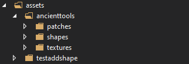

# Custom Mortar Shapes Guide

## Introduction
Do you want to see your own mods grindable items in the mortar instead of an ugly default shape? You can do that! 

## Here's How
A few steps is all it takes. 

1: Import the mortar shape found in ancienttools/shapes/block into VS ModelCreator. 
2: Import or create your own shape independant of the mortar heirarchy.
3: In your mod assets folder create an ancienttools folder for assets which Ancient Tools will use.
4: Add each of the following folders into the newly created ancienttools folder: patches, shapes, textures. It should look like the following image:

5. Export your resource shape into the shapes folder. IMPORTANT: The file name MUST be named a specific way. The name will always begin with 'resource', then must be followed up by the domain that the resource comes from, followed by the resources specific code path. As such: 'resource_{domain}_{firstcodepart}_{secondcodepart}.json'. If I wanted to create a shape for rice grain then the file name would be 'resource_game_grain_rice.json'.
6. Remove any textures references at the top of the shape file. Ensure that your shape faces have a unique "texture" value, though. "texture": "#mymod_resource" for example.
7. Import your textures into the textures folder if you're using custom textures.
8. Create a JSON patch within the patches folder that adds a texture reference to the mortar. The code should be similar to the following:

[
	{
		op: "add",
		path: "/textures/mymod_resource",
		file: "ancienttools:blocktypes/mortar",
		value: {
			base: "ancienttools:block/stone/rock/bauxite4"
		}
	}
]

That should really be it. Your shape/texture should now show up in the mortar anytime you place your resource inside. 
If you have any questions or if you feel this guide needs better explanation please contact Taska on Discord and let her know.